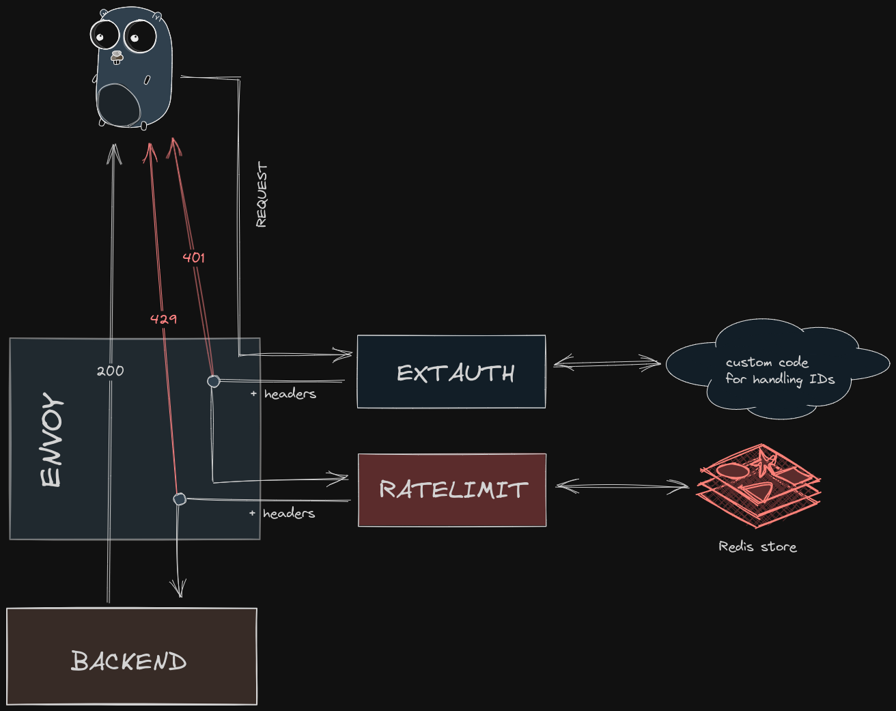

# Envoy Custom Ratelimiter Via Authorizer

The premise is to

* Use the authorizer to inject a custom header
* Pass that header's value to the rate limiter
* Use it for rate limiting



# The moving parts

The call flow is

- envoy on localhost port 8010
- checks with the external authorizer (extauth)
- that external authorizer sets a header
- envoy then checks with the ratelimiter, which persists it's state in redis
- if the check passes, it passes it to the backend, which returns a response which includes all the headers which were passed to it

The external authorizer is a tiny bit of custom code, which implements the external authorizer gRPC spec.

For now, it just returns a simple header:

```
Header: &core.HeaderValue{
	Key:   "x-ext-auth-ratelimit",
	Value: tokenSha,
},
```

In real life, this would probably be something like a user ID, or account ID, or the SHA of an API key ... whatever you want to rate limit on that you're aware of in your custom authorizer code. 

For the demo, a Bearer token must be passed in, e.g.

```
curl -H "Authorization: Bearer foo" http://localhost:8010/foo
```

Instead of checking with an external service, the authorizer verifies that it's exactly 3 characters long. `#secure`.

For the rate limiting key, a Base64'd and SHA'd version of the token is passed down. This makes it easy to compare different virtual users.


Envoy is configured (in `envoy.yaml`) to pass whatever value is set in that header, as well as the path the request was for, to the ratelimiter service.

```
rate_limits:
  - stage: 0
	actions:
	  - {request_headers: {header_name: "x-ext-auth-ratelimit", descriptor_key: "ratelimitkey"}}
	  - {request_headers: {header_name: ":path", descriptor_key: "path"}}
```

The ratelimiter is the standard [lyft ratelimit](https://github.com/lyft/ratelimit).

The config is buried down in `ratelimit-data/ratelimit/config/config.yaml` and is pretty simple:

```
domain: backend
descriptors:
  - key: ratelimitkey
    descriptors:
      - key: path
        rate_limit:
          requests_per_unit: 2
          unit: second
```

The domain is defined in the envoy config -- you can make it different for different parts of your service.

This config says to take the values that come with the `ratelimitkey` and `path` and build them into a joint key for rate limiting.

An example from the logs shows exactly how this works:

```
ratelimit_1  | time="2019-05-14T18:48:16Z" level=debug msg="cache key: backend_ratelimitkey_magic_path_/b_1557859696 current: 3"
ratelimit_1  | time="2019-05-14T18:48:16Z" level=debug msg="returning normal response"
```

The `backend` is a simple go http service. It prints the headers it gets to make it easy to see what headers are coming in with the request.

# Getting ready to build

* Clone this repo
* You'll also need a local copy of lyft's ratelimit. Just clone te ratelimit repo `git clone git@github.com:lyft/ratelimit.git`
* Run `docker-compose up`. The first one will take some time as it builds everything or pass `--build` to rebuild the code.

# Testing

You can ensure that the full stack is working with a simple curl:

```
$ curl -v -H "Authorization: Bearer foo" http://localhost:8010 
*   Trying 127.0.0.1:8010...
* Connected to localhost (127.0.0.1) port 8010 (#0)
> GET / HTTP/1.1
> Host: localhost:8010
> User-Agent: curl/7.81.0
> Accept: */*
> Authorization: Bearer foo
> 
* Mark bundle as not supporting multiuse
< HTTP/1.1 200 OK
< date: Fri, 31 Jan 2025 08:56:38 GMT
< content-length: 226
< content-type: text/plain; charset=utf-8
< x-envoy-upstream-service-time: 0
< server: envoy
< 
Oh, Hello!
Accept: */*
X-Forwarded-Proto: http
X-Request-Id: 890eac68-4145-48b6-ad27-6b7f2347275e
X-Ext-Auth-Ratelimit: LCa0a2j/xo/5m0U8HTBBNBNCLXBkg7+g+YpeiGJm564=
X-Envoy-Expected-Rq-Timeout-Ms: 15000
* Connection #0 to host localhost left intact
User-Agent: curl/7.81.0
```

There are also some Go tests available in the `vegeta` directory.

It builds on the `vegeta` tool, as a library, and runs standard go test library to check various scenarios.

```
$ make test
cd loadtest && go test -v=== RUN   TestEnvoyStack
=== RUN   TestEnvoyStack/single_authed_path,_target_2qps=== RUN   TestEnvoyStack/2_authed_paths,_single_user,_target_4qps
=== RUN   TestEnvoyStack/1_authed_paths,_dual_user,_target_4qps
=== RUN   TestEnvoyStack/unauthed,_target_0qps
--- PASS: TestEnvoyStack (40.01s)
    --- PASS: TestEnvoyStack/single_authed_path,_target_2qps (10.00s)
    --- PASS: TestEnvoyStack/2_authed_paths,_single_user,_target_4qps (10.00s)
    --- PASS: TestEnvoyStack/1_authed_paths,_dual_user,_target_4qps (10.00s)
    --- PASS: TestEnvoyStack/unauthed,_target_0qps (10.00s)
PASS
ok      _/workspace/work/envoy_ratelimit_example/vegeta/loadtest        40.013s
```
